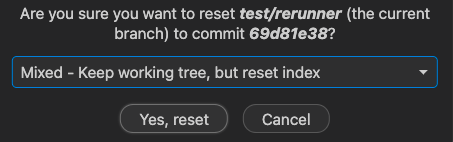

# Git Squash Documentation

## Description

The following documentation outlines how to Git Squash.

## Git Squash Commits with Git Graph

The following outlines how to Git Squash multiple commits easily in VS Code.

So, let's say we want to Git Squash to the base branch of our pr, we take note of the commit number `69d81e38`

So, we got to Git Graph in VS Code and then we look for that commit number and then go to one just before that and we want to do something like the following where we `reset` the current branch.

You want to click `Mixed` as the reset.

Once, that is reset, use `git add`, `git commit` and `git push` as normal and then you should see on Github that your branch has been squashed into one commit. 

If you are still having issues, refer to the following documentation [link](https://dannyherran.com/2020/06/git-squash-commit-vs-code/#:~:text=Right%2Dclick%20the%20commit%20that,current%20branch%20to%20this%20commit%E2%80%A6%E2%80%9D).