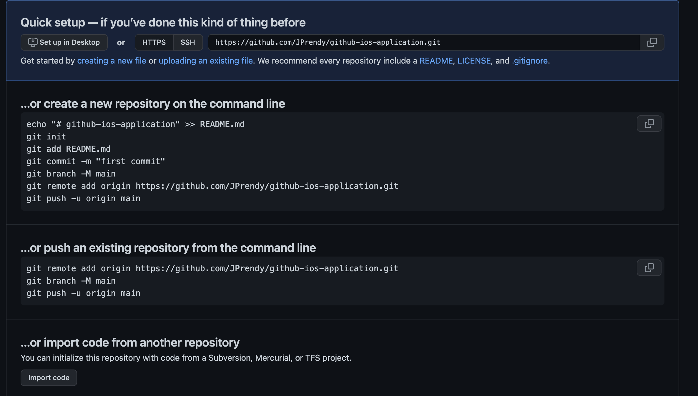

# Import code from another repository Documentation

## Description

The following documentation outlines how to import code from another repository.

## import code from another repository via the Github Website

The following outlines how to import code from another repository via the Github Website.

Go to the Github Website and click on the `New repository` button. 

Click the no template option and don't add any files like the README.md file or .gitignore.

Press the `Create repository` button.

You should see the following options:

You want to press the `...or import code from another repository` button.

The repo we import, it is important to briefly change it from 'private' to a 'public' repo.

After we press the `Begin import` button, we should be able to clone the new repo and continue our work from there.